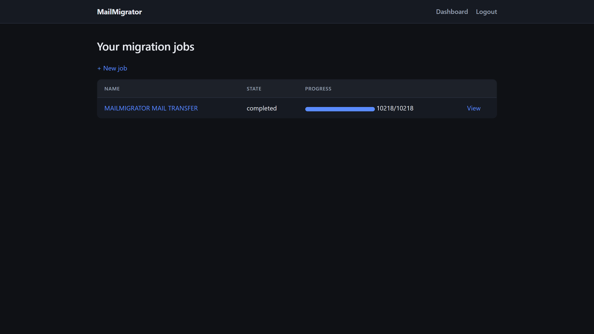
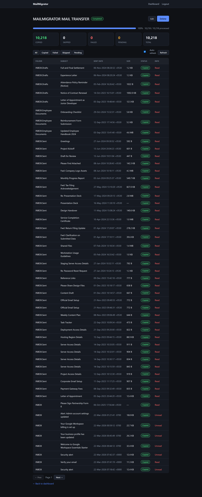
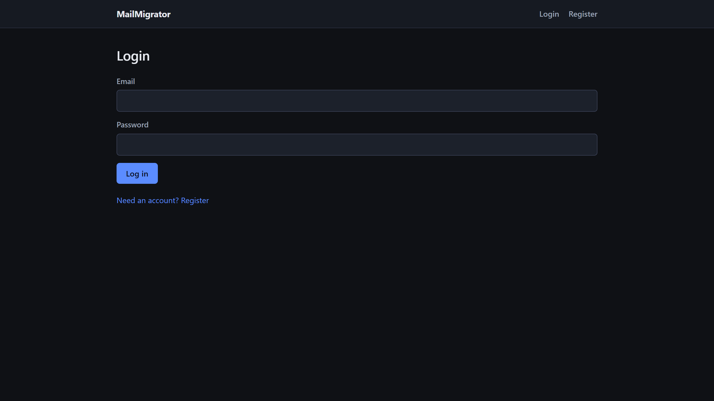

# MailMigrator

**Self-hosted IMAP-to-IMAP email migration tool.** Move a mailbox from one mail server to another — Gmail, Microsoft 365, cPanel/Dovecot, Zoho, Yahoo, or any IMAP host — without losing dates, folders, or read/unread state, and without ever deleting from the source.

[](LICENSE)
[](https://www.php.net/)


MailMigrator copies messages directly between two IMAP accounts and preserves their original send/receive dates, read and unread state, stars and flags, attachments, and the exact folder layout. It never forwards or re-sends mail (that resets every timestamp) and it never deletes anything from the account you are moving away from. Runs happen through a **resumable, de-duplicating** engine, so a migration that is interrupted simply continues where it left off — and re-running it never creates duplicates.

Use it two ways: a **command-line tool** for moving one or two accounts, or a **self-hostable web app** with user accounts, a live job dashboard, a background worker, and an optional paywall so you can offer migrations as a paid service. It is plain PHP with no framework, so it runs on ordinary shared hosting with a single cron job — no VPS or Docker required.

## Screenshots

<p align="center">
  
</p>

<p align="center">
  
</p>

<p align="center">
  
</p>

## Table of contents

- [Features](#features)
- [Supported mail providers](#supported-mail-providers)
- [How the migration works](#how-the-migration-works)
- [Quick start — command line](#quick-start--command-line)
- [Quick start — web app](#quick-start--web-app)
- [Running it as a paid service](#running-it-as-a-paid-service)
- [Security](#security)
- [Architecture](#architecture)
- [Tech stack](#tech-stack)
- [FAQ](#faq)
- [Contributing](#contributing)
- [Credits & attribution](#credits--attribution)
- [License](#license)

## Features

- **True copy, not forwarding** — messages are written with IMAP `APPEND`, preserving each message's original internal date. A two-year-old email still reads as two years old on the other side.
- **Preserves everything** — folders/labels, read/unread state, flags and stars, and attachments all come across intact.
- **Resumable** — a per-message ledger records progress before and after each copy. If the connection drops, the host kills the process, or a shared-hosting cron tick runs out of time, the next run picks up exactly where it stopped.
- **No duplicates** — before copying, MailMigrator checks the destination by `Message-ID` (with a content-hash fallback for servers that rewrite headers) and skips anything already there. Safe to re-run any time.
- **Built for big mailboxes** — messages are streamed one at a time with batching and throttling, so a mailbox of hundreds of thousands of messages won't exhaust memory or trip provider rate limits.
- **Smart folder mapping** — Gmail's special folders map to their `[Gmail]/…` equivalents and Dovecot's dotted folder names are normalized to a clean hierarchy. Both mappings are configurable.
- **Read-only source, append-only destination** — nothing is ever deleted on either side.
- **Two interfaces** — a scriptable CLI and a multi-user web dashboard sharing the same engine.
- **Optional paywall** — free and unlimited by default; turn on quotas and PayPal/Razorpay billing when you want to sell migrations.
- **Runs on shared hosting** — no framework, no VPS, no Docker. Just PHP and a cron job.

## Supported mail providers

Anything that speaks IMAP, which is almost everything. These are the ones people ask about most:

| Provider | Supported | Worth knowing |
| --- | --- | --- |
| Gmail / Google Workspace | ✅ | Enable IMAP and use a 16-character app password. Labels are handled as folders. |
| Outlook / Microsoft 365 | ✅ | Standard IMAP; app password required if the account uses modern auth. |
| cPanel / Dovecot hosts | ✅ | The common case for shared hosting and small-business email. |
| Yahoo Mail | ✅ | Requires a generated app password. |
| Zoho Mail | ✅ | Works with an application-specific password. |
| Hostinger, Namecheap, etc. | ✅ | Any cPanel-style mailbox. |
| Any other IMAP server | ✅ | If you can log in with an IMAP client, MailMigrator can move it. |

## How the migration works

Copying happens over IMAP using `APPEND`, the one operation that writes a message into a mailbox while preserving its original internal date. That is why a two-year-old email arrives dated two years ago instead of today.

Every message a job touches is written to a ledger before and after it is copied. That ledger is what makes runs safe to repeat: if the connection drops, the host kills the process, or you run out of time on a shared-hosting cron tick, the next run continues from the last recorded position instead of starting over.

Re-running a finished (or half-finished) job won't create duplicates. Before copying, MailMigrator checks whether the destination already has the message by its `Message-ID`, falling back to a content hash when a server has stripped or rewritten that header. Anything already present is skipped.

For large accounts, messages are streamed and copied one at a time with batching and throttling, so a 200,000-message mailbox doesn't try to load itself into memory or trip a provider's rate limits.

## Quick start — command line

```bash
git clone https://github.com/isumanbanerjee/email-migration.git mailmigrator
cd mailmigrator
composer install

cp config/accounts.example.php config/accounts.php   # fill in source + destination
php migrate.php --test-connection                    # check both logins, preview the folder map
php migrate.php --dry-run                             # report what would copy; writes nothing
php migrate.php --folder="INBOX" --limit=5            # tiny pilot you can eyeball
php migrate.php                                       # the real run (safe to re-run any time)
```

The order is the point: test the connection, do a dry run, copy a handful of messages as a pilot, then let the full migration go. By the time you run the last command you already know both accounts work and the folder mapping is right.

Options: `--config=PATH`, `--dry-run`, `--folder=NAME`, `--since=YYYY-MM-DD`, `--limit=N`, `--verbose`.

## Quick start — web app

```bash
composer install
cp .env.example .env         # set DB_*, generate APP_KEY, configure the paywall if you want one
php bin/migrate.php          # create the database tables
```

Point your web server's document root at `public/`, then register an account, create a job, and watch it run on the dashboard. Migrations are processed by a worker you trigger from cron, once a minute:

```cron
* * * * * /usr/bin/php /path/to/bin/worker.php >> worker.log 2>&1
```

Each tick claims one queued job, works on it for a short budget, saves progress, and exits; the next tick continues it. That is what lets long migrations finish under a shared host's execution limits. Full setup — PHP version, MySQL, `APP_KEY`, document root, cron, and payment webhooks — is in **[docs/deploy-shared-hosting.md](docs/deploy-shared-hosting.md)**.

## Running it as a paid service

The paywall is optional and off by default. Leave it off and everything is free and unlimited, which is what you want for a personal or internal tool. Turn it on and you can give each account a free quota (a number of jobs, a number of emails, or both), then require payment past that.

Three pricing models ship, and you enable whichever ones you want to sell: a one-time unlock for permanent access, credit packs measured in emails, and a monthly subscription. Payments go through **PayPal** or **Razorpay**. Entitlements are only ever granted from a webhook whose signature has been verified against the gateway — never from the browser redirect after checkout — so a user can't fake their way past the paywall by editing a URL. Duplicate webhook deliveries for the same payment won't grant twice.

## Security

The design assumption is that you may be holding other people's live email passwords, so the defaults are cautious. The source account is only ever read from, and the destination is only ever appended to — nothing is deleted on either side.

- **Encrypted credentials at rest** — stored IMAP passwords are encrypted with [`defuse/php-encryption`](https://github.com/defuse/php-encryption), using a key that lives only in your `.env` and never in the database. If someone reads your database, they still can't read the passwords.
- **Modern password hashing** — argon2id where the PHP build supports it, with a bcrypt fallback.
- **CSRF protection** on every form, and users can only see and act on their own jobs.
- **Signature-verified webhooks** for all billing events.

Two things are on you: serve the app over **HTTPS**, and keep `.env` **out of the web root**. Losing the key in `.env` means stored credentials can no longer be decrypted, so back it up somewhere safe.

## Architecture

```text
src/                    migration engine (framework-agnostic, MailMigrator\)
app/                    the web application (App\): router, controllers,
                        repositories, services, auth, billing
bin/worker.php          cron worker that runs and resumes jobs
bin/migrate.php         schema migrator
database/migrations/    portable SQL schema
public/                 web document root and front controller
migrate.php             standalone CLI migration tool
```

The engine in `src/` has no idea the web app exists — it is the same code the CLI uses, so you can pull it into your own project if all you want is the IMAP-to-IMAP copy.

## Tech stack

PHP 8.5, no framework. PDO with MySQL in production and SQLite for the test suite. IMAP handled by [`webklex/php-imap`](https://github.com/Webklex/php-imap), encryption by [`defuse/php-encryption`](https://github.com/defuse/php-encryption), routing by [`nikic/fast-route`](https://github.com/nikic/FastRoute), environment config by [`vlucas/phpdotenv`](https://github.com/vlucas/phpdotenv). The interface is Tailwind and Alpine.js. Tests run on PHPUnit.

```bash
composer test   # run the PHPUnit suite
```

## FAQ

**Does it delete anything from the old account?**
No. The source is opened read-only and the destination is append-only. Once you've confirmed the copy, deleting the old mailbox is a separate decision you make yourself.

**Will I get duplicate emails if I run it more than once?**
No. Messages already present at the destination are detected by `Message-ID` (with a content-hash fallback) and skipped, so re-running is safe.

**What happens if it crashes or times out halfway?**
It resumes. A per-message ledger records progress, and the next run continues from where it stopped rather than starting again.

**Are dates and read/unread status preserved?**
Yes. Messages are written with `APPEND`, which keeps the original internal date, and read/unread state and flags are carried over.

**How large a mailbox can it handle?**
It's built for big accounts — tens of thousands to a few hundred thousand messages — by streaming one message at a time with batching and throttling.

**Do I need a VPS?**
No. The web app runs on shared hosting with a cron job, and the CLI runs anywhere PHP does. A VPS is only worth it if your host blocks outbound IMAP.

**How do I migrate a Gmail or Google Workspace account?**
Enable IMAP in Gmail's settings and create an app password (you'll need 2-Step Verification on). Use that app password instead of the normal one.

**Is it free?**
The software is open source (MIT) and free to run. The built-in paywall is only there if you want to charge other people for migrations you run for them.

## Contributing

Issues and pull requests are welcome. Please run the test suite (`composer test`) before opening a PR, and keep changes focused. Bug reports that include the provider pair (source → destination) and any relevant log output are the easiest to act on.

## Credits & attribution

If MailMigrator helps you — whether for a personal migration, an internal tool, or a commercial/business project — please give credit. A visible mention and a link back to this repository is genuinely appreciated:

> Powered by [MailMigrator](https://github.com/isumanbanerjee/email-migration) by Suman Banerjee.

Attribution is a courtesy request, not a legal condition — the [MIT License](#license) only asks that you keep the copyright and license notice. But if you use it commercially, a credit (in your footer, docs, or an "about" page), a ⭐ on the repo, or simply telling me where it's running all help the project reach more people.

## License

Released under the [MIT License](LICENSE). Copyright © Suman Banerjee.
